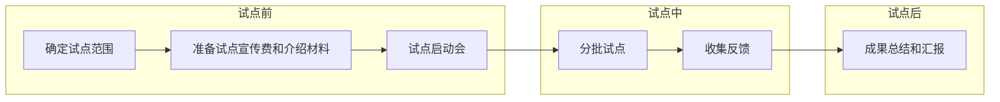

# 五、试点工作
**试点工作的主要目的：**
1. **验证方案有效性：** 确认运营方案的具体措施在实际操作中的有效性，并且这个过程也能够检验上线的系统和工具在真实环境下的适用性。
2. **提前发现和解决问题：** 通过圈定有限的试点范围并进行实施，及时发现和识别实施过程中可能遇到的技术和管理问题，并解决问题或者进行运营策略的调整，避免问题遗留到项目的全面推广环节。
3. **优化制度规范和流程：** 基于试点工作中接收到的反馈和对试点结果的分析，对制度规范初稿、项目运营流程进行优化和调整，提高制度规范的可操作性。
4. **评估和调整项目指标：** 根据试点的结果来评估项目目标的合理性，并调整和设定更加准确和实际的项目成功评估指标和阶段性目标，便于正式运营后对项目整体效果的评估。
5. **避免破坏用户信息：** 通过小范围的样本验证，保障未来运营时意外的故障和问题不会对线上大量的研发和业务人员产生影响，从而导致用户的信心丢失。

## 5.1 试点工作计划
我们把整个试点环节分为三部分，分别是试点前、试点中和试点后：
- 试点前：**确定试点范围**对于整个试点工作起到至关重要的作用，根据业务的关键级别和业务部门配合程度等多个维度划出试点范围。为了试点工作的顺利进行，应该确保参与试点的相关方都能明确自己的工作内容和职责，因此**准备试点宣贯和介绍材料**，并召开**试点启动会**进行宣贯是必不可少的环节。

- 试点中：在实际试点的过程中，使用**分批试点**的方式能够逐步验证和调整项目策略，避免因为过程中产生的问题直接影响整体试点工作和最后的效果。同时设立有效的机制来**收集反馈**，以便及时发现和解决问题。

- 试点后：**成果总结和汇报**环节是对试点项目进行回顾和评估的重要步骤，通过对试点结果进行分析和效果数据整理，准备汇报材料，并召集试点相关方和项目决策层进行汇报，提升项目决策层对未来项目正式推广运营的信心。

## 5.2 确定试点范围
试点范围一般是在公司中选择几个部门或团队进行，这些参与试点的部门/团队一定要具有代表性。这样做的好处是一方面可以充分验证 SCA 运营方案在不同场景下的实施效果，确保试点结果的普遍适用性；另一方面是试点结束并取得阶段性的成果后，这些代表性的部门/团队作为参与方可以帮助我们提升整个项目在公司内的影响力，也会提高未来项目正式运营后其他部门/团队的配合程度。

### 5.2.1 关键点
在具体选择参与试点的部门/团队时，我们可以根据一些维度进行筛选。通常重点会考虑的是部门/团队的业务重要性以及配合程度，除此之外还有其他维度可以考虑。
<!DOCTYPE html>
<html lang="en">
<head>
    <meta charset="UTF-8">
    <meta name="viewport" content="width=device-width, initial-scale=1.0">
</head>
<body>

<table>
    <tr>
        <th>评估维度</th>
        <th>评估说明</th>
        <th>评估权重</th>
    </tr>
    <tr>
        <td>业务重要性</td>
        <td>评估该部门/团队是否存在公司的重要业务，是否属于公司的重要事业群组。通常情况下，重要性越高的业务对于安全越重视，对于代码中出现的安全风险会花费更多的精力去处理。因此存在公司重要业务的部门/团队更加适合参与试点。</td>
        <td>30%</td>
    </tr>
    <tr>
        <td>配合程度</td>
        <td>评估该部门/团队对安全工作的配合程度，可以结合历史安全问题处置的态度和积极程度进行评估。配合度较高的部门/团队，在试点过程中对出现各种各样的问题接受度也会较高。因此对安全工作配合度高的部门/团队更加适合参与试点。</td>
        <td>30%</td>
    </tr>
    <tr>
        <td>业务迭代速度</td>
        <td>业务迭代速度一般或较快的部门/团队，对于代码安全问题处理带来的历史负担较轻，因此配合度相对较高。对于迭代速度较慢或基本处于维护状态的业务，修复安全问题带来的稳定性风险较大，并且修复过程中遇到的问题也更加复杂。因此迭代速度较快的部门/团队可能更加适合参与试点。</td>
        <td>25%</td>
    </tr>
    <tr>
        <td>技术栈复杂度</td>
        <td>技术栈过于复杂，会导致试点过程中遇到的问题较多，而在试点阶段项目可能不会有很多的人力去解决这些问题。技术栈复杂度可以通过对其代码库的语言类型进行评估，如果该部门/团队下的大部分代码仓库都是属于公司主流的开发语言，那可能更加适合参与试点。</td>
        <td>15%</td>
    </tr>
</table>

</body>
</html>

## 5.3 试点宣贯准备
确定了试点范围，在正式开始试点之前我们要召集参与试点的相关方，通过启动会的形式对项目进行介绍以及对项目试点工作进行宣贯。目的是确保所有试点参与者都能充分理解试点项目的目标、流程、预期成果以及他们的角色和责任。 

为了试点启动会能达到令人满意的效果，因此我们需要提前准备好详尽的宣贯材料。
### 5.3.1 关键点
在准备试点宣贯材料时，至少应该要包含以下内容。下面表格是材料中包含的内容、内容的说明以及内容应该着重关注的关键点。
<!DOCTYPE html>
<html lang="en">
<head>
    <meta charset="UTF-8">
    <meta name="viewport" content="width=device-width, initial-scale=1.0">
</head>
<body>

<table>
    <tr>
        <th>序号</th>
        <th>内容</th>
        <th>说明</th>
        <th>关键点</th>
    </tr>
    <tr>
        <td>1</td>
        <td>试点项目背景</td>
        <td>讲清楚试点项目的背景信息，解释为什么会启动这个项目，以及项目的总体目标是什么</td>
        <td>讲述项目背景时要站在更高的角度，让大家明确项目的重要性和预期，对公司和业务的长远影响</td>
    </tr>
    <tr>
        <td>2</td>
        <td>试点项目的具体目标</td>
        <td>列出试点项目的具体目标，描述试点预期达到的成果，以及这些成果对试点参与方的收益</td>
        <td>讲清楚对试点参与方的收益，让参与方明确</td>
    </tr>
    <tr>
        <td>3</td>
        <td>参与方的角色和责任</td>
        <td>列出有哪些参与者、角色，以及他们的责任</td>
        <td>确保每个人都清楚自己在项目中的作用和期望贡献</td>
    </tr>
    <tr>
        <td>4</td>
        <td>详细的操作说明</td>
        <td>整理详细的操作流程和步骤，包括如何使用相关工具</td>
        <td>包括常见问题的解答，帮助参与者解决可能遇到的问题</td>
    </tr>
    <tr>
        <td>5</td>
        <td>问题反馈</td>
        <td>明确试点过程中遇到问题的反馈渠道</td>
        <td>确保参与试点的员工出现问题时能够及时响应</td>
    </tr>
</table>

</body>
</html>

## 5.4 试点启动会
准备好宣贯材料之后，就开始组织试点参与方召开启动会。通过这次启动会要让所有参与试点的角色都能清晰自己的角色和责任，了解在试点过程中具体要做哪些事情，会议后正式启动试点工作。

### 5.4.1 关键点
启动会开始之前，首先要确定所有需要参会的人员，包括参与试点部门/团队的管理层、技术专家、安全部门的管理者以及参与运营的相关同事，其次要确保所有参与者都被及时通知会议时间和地点，最后是准备详细的会议议程并按照议程完成启动会的召开。

### 5.4.2 会议议程
- 项目介绍；
- 目标和预期成果；
- 角色和责任分配；
- 项目流程和时间表；
- 答疑环节。

## 5.5 分批试点
### 5.5.1 分批设计
应该优先选择关系最好，对安全工作配合度最高的部门作为第一批试点，第一批试点的范围应该尽可能小，这样保证及时试点初期出现一些严重的流程和工具能力上的缺陷时，对用户造成的影响是可控的。 

接下来，应该明确后续每一批的试点范围及试点时间。

### 5.5.2 试点工作计划

### 5.5.2.1 存量风险梳理
### 5.5.2.1.1 存量全量风险检测
试点对公司代码仓库中的全量风险进行检测：
- 治理范围：全量的GitLab仓库及容器镜像仓库harbor
- 接入检测：
  - **GitLab：** 通过SCA检测平台对接GitLab API，配置一个有全局权限的token来实现
  - **harbor：** 通过 SCA 检测平台对接 HarBor API（不同版本的 Harbor 的 API 略有差异。），配置一个具有全局权限的账号和密码来实现。
### 5.5.2.1.2 高优先级治理风险筛选
我们需要通过相对科学的风险分级策略，筛选出来高风险及高处置优先级的安全问题。

- **筛选策略**  

   原则：如果被攻击成功导致系统中断、数据泄露等，造成损失越大的，越优先处理。

- **综合考虑如下点:**  
  (1) 漏洞危害程度：RCE、反序列化、注入、投毒等能直接拿到权限和数据的优先修复、SSRF等次之。 
  (2) 利用复杂度和利用环境：优先处理互联网能攻击、利用成本低和漏洞可达的。其次是纯内网环境（如 dubbo）等攻击成本为中等的或更高的。 
  (3) 升级兼容性：无兼容性风险的可以优先升级，存在兼容性风险的需要全量回归测试，存在一定的风险。 
  (4) 业务重要程度：根据业务和应用重要程度进行排序，越重要越优先处理。 
  (5) 系统业务属性：分为对互联网暴露的和纯内网访问的。对互联网暴露的优先修复。

举例来说，struts、fastjson、log4j2、ruoyi等重点风险组件需要尽快修复。

### 5.5.2.1.3  分批处置策略
根据筛选出来的需要高优先级处理的风险，我们需要分批分阶段的进行处置，避免一次性给业务带来太大的压力和负担，通常进行分批推进的时候需要重点关注以下几个方面：
- 优先策略：优先选择配合度高、业务重要性高、外网业务等；
- 确定责任人：必须要对每一批处置范围明确责任人；
- 确定处置时限：与责任人确定明确的处置时限及对应的处置措施（如纳入考核、强制下线、限制发布等）；
- 目标对齐：以上相关信息必须与责任人及支持运营的团队对齐，保障各方有效协同落地。

### 5.5.2.2 高危风险治理
### 5.5.2.2.1 相关责任人
在进行风险修复处置时，应明确该风险关联负责人，在进行项目负责人查询时，根据企业内部管理形式采用对应查询方式，例如： 
- 通过被检查代码分支关联提交人定位相关项目负责人；
- 通过内部应用管理平台查询相关项目负责人。

### 5.5.2.2.2 处置流程
1. 明确风险处置的必要性（可根据高优先级治理风险筛选策略研判）； 
2. 提供风险处置建议； 
3. 提交漏洞修复工单并指派项目负责人； 
4. 确认风险处置结果并验证； 
5. 关闭工单并归档。

### 5.5.2.3 增量风险卡位
卡位的一个非常重要的价值是对不遵守安全策略的行为具备强行管控的能力，这样安全策略的实施落地才具备强有力的抓手。但是卡位的顺利落地需要慎重考虑对于现有业务流程效率的最小影响，通常需要考虑检测速度、检测准确率及例外情况的豁免措施等等，关于豁免措施，可以包括：漏洞细粒度白名单，用户自主误报反馈，以及紧急上线功能审批等，给与使用者一定的主动权，但是保留安全的审批权。 

其中，检测速度和检测准确率需要和相关流水线的负责人进行协商确定，但是最终的准则都是对业务发布流程的体验不要有明显的损失，更不要阻塞现有的发布流程。

### 5.5.2.3.1 优劣势分析
- **优势**  

    a.通过集成可以确保每一次代码构建都能够自动进行风险检测，及时发现项目存在的风险。 
    b.可以根据公司的管理制度规范对存在风险未修复的项目上线进行卡位，倒逼研发在上线前修复安全问题。 
    
- **劣势**  

    a.由于是在构建过程中进行安全检测，可能会增加项目整体构建时间。 
    b.项目构建环节风险发现相对后置，如项目存在必须处置安全风险，可能会导致项目上线推迟，如果漏洞修复成本较高会导致项目延期，同时容易引起研发反弹情绪。

### 5.5.2.3.2 卡位点选择
***1.Jenkins***
***在Jenkins 构建环节引入安全产品的安全检测能力对待构建项目进行安全检测，对于安全检测能力的调用一般可以通过以下方式：***  
    
a.客户端工具集成(适用于安全产品有封装好安全检测能力的客户端工具的情况下): 
- (1)安装客户端工具到jenkins 构建服务器。
- (2)在项目构建流水线中调用客户端工具对待上线项目进行检测.
- (3)获取项目检测结果，结合安全基线进行风险卡位。

b.Open API 集成(适用于安全产品具备功能完善的Open API，该方式对项目构建时长影响较大) 
- (1)在项目构建流水线中通过调用安全产品 Open API 上传待上线项目包进行安全检测。
- (2)通过对应结果查询接口获取检测结果，结合安全基线进行风险卡位。

***2.GitLab CI/CD***
**在GitLab CI/CD的流水线配置中，可以使用自定义脚本来调用第三方代码安全检测工具。**
 
- 可以通过在.gitlab-ci.yml文件中定义特定的阶段（stage）和任务（job），在其中执行安全检测工具的命令。
- 可以通过修改 GitLab Runner 配置的方式，在代码进入CI阶段前，进行自动开源风险扫描，并可选择是否设置卡点(此方案无需项目做任何变更即可完成接入)。
- 这种卡点方式需要用户自己配置.gitlab-ci.yml文件，研发可以对这个配置进行删改。如果无法真正做到制度强管控，很难实现100%卡点，所以如果采用这种卡位机制需要考虑一方面从制度管理上强管控，另外一方面也可以使用技术手段对.gitlab-ci.yml文件是否存在及是否合理配置进行审计抽查。

注： 小米有此类的最佳实践，可参考：https://mp.weixin.qq.com/s/bSFkkGSxCBHZ22VAh3XgPA

### 5.5.2.3.3 实施步骤

**a.增量风险记录** 

- (1)根据 CI/CD 集成检测，对上线项目增量风险进行记录； 
- (2)项目增量高风险组件推修（推修可参考高优先级治理风险筛选策略）； 
- (3)分析项目风险情况，制定卡位处置策略，具体卡位的策略可根据企业的实际情况进行设计，这里也推荐一下涂鸦智能之前采取过的策略，就是当期发现的问题，下期发布的时候卡点，不卡当期，这个适合一开始推进研发效率影响比较大的时候。 
- **a)灰度试点**  
- (1) 根据试点项目重要程度分批上线卡位处置策略。 
- **b)全量卡位上线**  
- (1) 根据灰度试点情况调整卡位规则，全量项目卡位上线。

### 5.5.2.4 准入管控
### 5.5.2.4.1 准入管控方案设计
***- 目的***

在组件引入阶段进行风险组件卡位，防止高危开源组件及投毒组件引入，同时避免内部自研二方组件风险扩散，降低风险后置处置成本，提升项目安全性。

***- 优劣势分析 ***

- **a.优势：**  
  (1)安全左移至组件引入源头，降低风险后置处置成本。 
  (2)突发 0day&投毒及时拦截，降低应急成本。 
  (3)降低内部自研组件风险扩散。
- **b.劣势：**  
  在项目构建拉取组件时会增加整体项目构建时间，但是基本上可控制在5%以内。

***- 方案设计 ***
- a.通过在内部私服仓库集成插件实现与检测服务端通信； 
- b.在服务端配置安全准入规则，及处置策略； 
- c.在研发本地进行组件拉取及项目构建拉取组件时进行安全验证； 
- d.基于命中准入规则对应的处置策略对风险组件进行处置（审计记录/拦截并记录）； 
- e.为临时紧急的业务需求设计豁免通道。

### 5.5.2.4.2 常见的准入管控实现方式

***1.Nexus*** 
- **集成方式**
  - (1)通过 Nexus 网关插件实现网关能力集成；
  - (2)基于内部安全基线配置准入规则；
  - (3)基于准入规则对拉取组件进行安全验证并处置。 

***2.Jfrog*** 
- **集成方式**
  - (1)通过 Jfrog 网关插件实现网关能力集成；
  - (2)基于内部安全基线配置准入规则；
  - (3)基于准入规则对拉取组件进行安全验证并处置。 

### 5.5.2.4.3 实施方案
***1.准入管控策略设计：明确范围*** 
- a. 将内部现有禁止使用的组件版本纳入管理范围，加入黑名单； 
- b. 通过代码仓集成对现有业务代码进行检测，建立资产台账及风险组件清单，与业务部门沟通评估需纳入管控的组件版本，并加入准入规则； 
- c. 根据组件安全情况更新准入规则； 
- d. 企业内部开发的通用组件（二方组件），也应该纳入管控范围，存在高危风险的二方组件应该限制在内部发布，包括应该维护内部组件的历史漏洞信息知识库。 

***2.审计观察*** 
- a. 针对纳入管控的组件版本可以先通过审计处置策略，记录规则命中情况及影响项目范围。 

***3.通知整改*** 
- a. 根据审计记录定位命中规则的项目，并通知相关项目负责人进行整改。

***4.豁免通道设计*** 
- a. 在卡位正式上线前，还是要设计豁免的通道，包括申请豁免的流程及快速响应机制； 
- b. 针对豁免的流程设计需要考虑让申请方承担责任，同时事后有监督整改的机制尽快缩小风险窗口。

***5.卡位上线*** 
- a. 提前通知可能受影响的人群。 
- b. 调整准入规则处置策略为拦截模式，并设定拦截提醒。

***6.异常反馈*** 
- a. 建立异常反馈渠道，收集异常信息。 
- b. 根据异常反馈信息调整策略。

### 5.5.2.5 应急响应
模拟当出现新0day时，基于SCA工具收集的SBOM信息进行排查 
- a.0day曝出； 
- b.风险排查； 
- c.应急处置：
  - (1)止损；
  - (2)问题修复；
  - (3)安全防护能力提升：针对此漏洞，添加WAF规则、xAST检测规则、xDS检测策略等。

## 5.6 收集反馈
***设立反馈机制***

- 用户主动反馈：
  - 有奖反馈。
  - 关键人员访谈奖励。

- 数据观测：
  - 漏洞修复率。
  - 漏洞修复时效。
  - CI/CD接入后影响。
  - 准入拦截率。
  - 漏洞修复成本。
  - 研发效率的影响：这个需要联合工程效率团队来统计。

## 5.7 成果总结和汇报
**试点结束后，对试点过程中发现的问题和验证的成果进行总结，充分证明该运营方案的有效性。**
**准备总结报告和汇报材料**
- 技术方案的可行性：
  - 各试点任务的验证情况。

- 预期的效果达成情况（结果和成本）：
  - 部门支持及配合情况；
  - 安全问题发现情况；
  - 安全问题处置情况；
  - 满意度。

- 问题及改进：
  - 过程中发现的问题；
  - 改进的流程；
  - 待解决问题。

- 组织汇报会议：
  - 汇报对象；
  - 汇报内容；
  - 预期效果；
  - 下一步工作计划。
