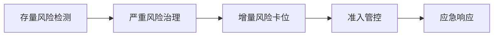
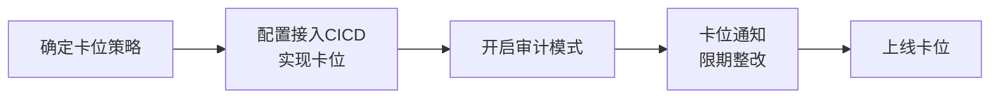

# 八、正式上线推广
根据正式运营方案及制度规范要求落实开源安全治理工作，将开源安全治理工作全面推广至企业内部，确保开源安全治理的全面实施和有效执行，最终保障项目取得优异的成果。

## 8.1 启动会准备
启动会主要是面向项目所有的参与方及目标用户人群，目标是为了拉齐大家对于项目价值的认知并明确各方的职责，为保证启动会正常召开，在召开启动会前，应做以下准备：
1. 准备会议材料：准备启动会所需各项材料；
2. 制定会议议程：会议主题、内容安排、时间安排、会议地点等；
3. 确定参会人员：明确参加启动会的人员范围，包括各部门负责人、关键利益相关方以及项目团队成员等；
4. 会前预沟通：与相关参会人员提前沟通，确保相关方能够提前了解会议沟通信息，并达成初步一致。

## 8.2 召开启动会
召开启动会旨在向相关部门及利益相关方介绍开源安全治理工作背景、目标、实施计划及实施方式，确保所有参与者对开源安全治理工作有清晰的认知和理解，明确各方参与者在整个开源安全治理过程中的责任及分工，保证开源安全治理工作能够在企业内部顺利展开并运营。

因此启动会应包含以下讨论内容： 
- a. **开源安全治理背景介绍：** 可以以立项材料中阐述的内容为主，包括项目需求背景、目标等方面的内容。 
- b. **项目方案介绍：** 介绍整体的项目方案，目的是让参会人员理解项目具体是要做什么、怎么做、预计达成什么样的目标、项目落地后达到什么样的效果，同时可分享一下试点阶段的成果，增强大家的信心。 
- c. **制度规范和流程解释：** 针对某个特定流程，应讲述清楚具体流程的相关制度及流程中各角色需要承担的义务以及责任。 
- d. **实施计划：** 明确开源治理工作最终目标和具体实施计划，明确实施过程中各个环节参与方的责任与分工，让所参与者明确自己的工作内容及责任。 
- e. **项目里程碑：** 依据实施计划，设定项目阶段里程碑，目的是让每个团队了解项目节奏，并具有时间的紧迫感。 
- f. **各团队需要支持的内容：** 最后通过一个表格的形式例举出每个角色在项目中需要支持的内容。 
- g. **关于成果及表彰：** 介绍该项目运营过程中，对于积极参与配合项目开展的小伙伴会以月度、季度、年度的方式开展奖励计划。 
- h. **讨论与答疑：** 如参会人员有疑问，需要进行充分讨论和答疑，保证会议结束后参会人员有明确的工作内容和工作目标。

## 8.3 正式推广治理
将开源软件安全治理相关的能力嵌入至软件开发及管理流程，逐步开展治理工作。

下图是关于治理能力与软件研发流程的一个结合示意图

下图是关于分阶段开展开源软件安全风险治理的一个逻辑流程示意图：

### 8.3.1  存量风险梳理
**试点对公司代码仓库中的全量风险进行检测：**
- **治理范围：** 全量的gitlab仓库及容器镜像仓库harbor。
- **接入检测：**
  - GitLab：通过SCA检测平台对接GitLab API，配置一个有全局权限的token来实现；
  - harbor：通过 SCA 检测平台对接 HarBor API（不同版本的 Harbor 的 API 略有差异），配置一个具有全局权限的账号和密码来实现。

**优先级分级策略：**

- 筛选策略： 

  **原则：** 如果被攻击成功导致系统中断、数据泄露等，造成损失越大的，越优先处理。 
  **综合考虑如下点：**  
  (1)漏洞危害程度：RCE、反序列化、注入、投毒等能直接拿到权限和数据的优先修复、SSRF等次之。 
  (2)利用复杂度和利用环境：优先处理互联网能攻击、利用成本低和漏洞可达的。其次是纯内网环境（如 dubbo）等攻击成本为中等的或更高的。 
  (3)升级兼容性：无兼容性风险的可以优先升级，存在兼容性风险的需要全量回归测试，存在一定的风险。 
  (4)业务重要程度：根据业务和应用重要程度进行排序，越重要越优先处理。 
  
举例来说，struts、fastjson、log4j2、ruoyi等重点风险组件需要尽快修复。
### 8.3.2 高危风险治理
### 8.3.2.1 高危风险策略

关于企业高危风险的定级策略应该考虑业务重要性、是否具备外网暴露面、漏洞等级、许可证合规风险等级来综合评定。

关于安全漏洞的处置优先级，只考虑业务重要性、是否具备外网暴露面、漏洞等级：
- 业务重要性：将业务按照数据敏感程度及业务重要程度结合起来分为三级；
- 是否存在外网暴露面：是/否；
- 漏洞风险等级：
  - 强烈建议修复： 
    CVSS>=7（高危以上）、有 POC 、存在可直接导致数据泄漏的漏洞类型 、利用条件为低。
  - 建议修复： 
    (1)CVSS>=7（高危以上）、有 POC 的、存在可直接导致数据泄漏的漏洞类型 、利用条件为高。 
    (2)CVSS>=7（高危以上）、有 POC 的、存在可直接导致数据泄漏的漏洞类型 、利用条件为中。 
    (3)CVSS>=7（高危以上）、有 POC 的、不存在可直接导致数据泄漏的漏洞类型 、利用条件为低。 
    (4)CVSS>=7（高危以上）、有 POC 的、不存在可直接导致数据泄漏的漏洞类型 、利用条件为中。 
    (5)CVSS>=7（高危以上）、有 POC 的、不存在可直接导致数据泄漏的漏洞类型 、利用条件为高。
  - 可选修复： 
    未命中以上条件的其他情况。

建议，最优先处理最高级别的业务 + 外网有暴露面 + 强烈建议修复的安全问题。

### 8.3.2.2 分批策略
<!DOCTYPE html>
<html lang="en">
<head>
    <meta charset="UTF-8">
    <meta name="viewport" content="width=device-width, initial-scale=1.0">
</head>
<body>

<table>
    <tr>
        <th></th>
        <th>业务重要性</th>
        <th>外网暴露面</th>
        <th>安全漏洞处置等级</th>
    </tr>
    <tr>
        <td>第一批次</td>
        <td>A</td>
        <td>是</td>
        <td>强烈建议修复</td>
    </tr>
    <tr>
        <td>第二批次</td>
        <td>B</td>
        <td>是</td>
        <td>强烈建议修复</td>
    </tr>
    <tr>
        <td>第三批次</td>
        <td>C</td>
        <td>是</td>
        <td>强烈建议修复</td>
    </tr>
    <tr>
        <td>第四批次</td>
        <td>A/B/C</td>
        <td>是</td>
        <td>建议修复</td>
    </tr>
    <tr>
        <td>第五批次</td>
        <td>A/B/C</td>
        <td>是</td>
        <td>可选修复</td>
    </tr>
    <tr>
        <td>第六批次</td>
        <td>A</td>
        <td>否</td>
        <td>强烈建议修复</td>
    </tr>
    <tr>
        <td rowspan="3">以此类推</td>
        <td rowspan="1" colspan="3">1.优先考虑是否有外网暴露面</td>
    </tr>
     <tr>
        <td rowspan="1" colspan="3">2.其次考虑是否强烈建议修复</td>
    </tr>
     <tr>
        <td rowspan="1" colspan="3">3.再考虑业务等级</td>
    </tr>
</table>
</body>
</html>

### 8.3.2.3 分批推进方案
分批推进的方案，原则上是以代码仓库为基准单位，存量的代码项目风险治理一批，然后对这一批代码项目进行增量的风险卡位。 

所谓的风险卡位就是在CICD流程中实现门禁，当代码项目进行编译构建发布时，检测是否存在强烈建议修复的开源组件漏洞，如果存在则编译失败，要求开发者修复完这些安全问题后再提交编译通过。以此方式倒逼软件开发者在软件开发环节中将这些严重的安全风险提前修复。 

每一批次的存量风险，应该要求相关负责人在规定的时间内，主动整改已知的安全风险，如果不按期完成整改风险，将直接上线安全门禁。不过建议在规定时间到期时，应通过宣贯、沟通等方式，保障至少有超过70%的安全问题被处理，剩下的30%可以强制执行。 

### 8.3.2.1 相关责任人
在进行风险修复处置时，应明确该风险关联负责人，在进行项目负责人查询时，根据企业内部管理形式采用对应查询方式，例如：
- 通过被检查代码分支关联提交人定位相关项目负责人。
- 通过内部应用管理平台查询相关项目负责人。

### 8.3.2.2 处置流程
1. 明确风险处置的必要性（可根据高优先级治理风险筛选策略研判）；
2. 提供风险处置建议；
3. 提交漏洞修复工单并指派项目负责人；
4. 确认风险处置结果并验证；
5. 关闭工单并归档。

### 8.3.3 增量风险卡位
### 8.3.3.1 确定范围

卡位的范围应该考虑从业务分级和风险分级两个维度来选定，同时和11.3.2.3中的分批推进策略保持一致。

### 8.3.3.2 确定卡位策略
### 8.3.3.2.1 卡位策略配置

卡位策略包括阻断和审计两种模式，首先准备好需要配置进行审计或者阻断的项目列表及漏洞列表范围，然后进行配置上线。

### 8.3.3.2.2 例外流程设计

通常需要设计例外流程，当某些业务被阻断编译构建，但是业务又需要紧急上线发布时，相关人员可以通过申请例外流程来临时放行，通过这样的方式可以避免重要紧急的业务需求被阻断。

### 8.3.3.3 卡位实现

因为卡位通常可能会对现有的业务流程造成影响，所以需要分四步走，保障整个卡位过程的丝滑：

### 8.3.3.3.1 确定卡位策略
8.3.3.2章节已经明确了卡位策略，这里只需要复用即可。

### 8.3.3.3.2 实现方案
- **基于Jenkins CI/CD 的实现方案：**  
  在jenkins 构建环节引入安全产品的安全检测能力对待构建项目进行安全检测，对于安全检测能力的调用一般可以通过以下方式： 
    a.客户端工具集成（适用于安全产品有封装好安全检测能力的客户端工具的情况下）： 
    - (1)安装客户端工具到jenkins 构建服务器； 
    - (2)在项目构建流水线中调用客户端工具对待上线项目进行检测； 
    - (3)获取项目检测结果，结合安全基线进行风险卡位。 
    
    b.Open API 集成（适用于安全产品具备功能完善的Open API，该方式对项目构建时长影响较大）： 
    - (1)在项目构建流水线中通过调用安全产品 Open API 上传待上线项目包进行安全检测； 
    - (2)通过对应结果查询接口获取检测结果，结合安全基线进行风险卡位。 

- **基于GitLab CI/CD 的实现方案：**  
    a.在GitLab CI/CD的流水线配置中，可以使用自定义脚本来调用第三方代码安全检测工具。 
    b.可以通过在.gitlab-ci.yml文件中定义特定的阶段（stage）和任务（job），在其中执行安全检测工具的命令。 
    c.获取项目检测结果，结合安全基线进行风险卡位
  
### 8.3.3.3.3 开启审计模式
在明确卡位策略和范围后，可以先将此批范围的代码项目和漏洞级别配置审计模式，通过审计模式来观察当前还有多少项目存在的即将被阻断风险，并输出每日的审计记录清单，以此来预估未来卡位时会带来多大的影响。
### 8.3.3.3.4 限期整改
对这一批卡位可能影响的所有用户人群范围进行邮件及IM消息等各种方式的通告，一定要明确告知用户卡位的具体策略是什么？以确保大家知晓可能面临的卡位和应对措施。
- **通告方式：** 邮件&IM&电话等，正式卡位前至少预留一个月的时间给大家提前整改，在启动时通知和临近卡位上线前7天、1天再次通知；
- **通告内容：** 明确且清晰的卡位策略，针对哪些项目范围及卡位的具体条件，比如漏洞缺陷等级等。卡位后的应对措施等，包括但不限于例外申请、问题咨询、自查整改等；
- **限期整改：** 对前期审计过程中发现的可能导致阻断的所有用户行为，统计后发给对应的用户，要求其限期整改，并明确告知如果不整改可能导致的影响；
- **应对措施：** 应考虑用户在被卡位后，可能出现的影响并给出应对措施，包括告知用户如何提前自查整改项目问题，例外申请等；
- **惩罚措施：** 考虑到会出现少部分人不按期整改的情况，需要和业务方负责人对逾期不完成任务的情况进行处罚，首先参考公司相关制度规范、此外还包括公开通道、纳入绩效考核评分等。

### 8.3.3.3.5 上线卡位
当限期整改期满，且整改整体进度超过70～80%时，可考虑直接上线卡位。如果整改期满，且整改整体进度低于70%，那么应该分析是哪个环节出了问题，并积极调整后，促使整改进度超过70%后，推进卡位的上线。

### 8.3.4 私有源准入准出管控
基于CI/CD的卡位流程是更偏事后的，此时代码已经开发完了准备发布上线，这时发现的安全漏洞修复成本非常高，所以很多企业考虑在研发过程中，甚至代码开发之前就能识别并管控风险。那么对企业使用的内部私有源（nexus、jfrog）进行管控就成了最有效的方式。

### 8.3.4.1 确定范围
卡位范围可参考11.3.2.2，卡位范围可以分为哪些需要拦截、哪些需要审计的两类风险，需要拦截的通常至少是强烈建议修复范围的组件及版本范围，而需要审计的通常是危害严重但是又无法直接拦截的部分。

### 8.3.4.2 确定卡位策略
### 8.3.4.2.1 卡位策略配置
卡位策略包括阻断和审计两种模式，首先准备好需要配置进行审计或者阻断的组件及版本列表，然后进行配置上线，所有待阻断的行为都先发布审计。

### 8.3.4.2.2 例外流程设计
通常需要设计例外流程，当某些业务被阻断编译构建，但是业务又需要紧急上线发布时，相关人员可以通过申请例外流程来临时放行，通过这样的方式可以避免重要紧急的业务需求被阻断。

### 8.3.4.3 卡位实现
### 8.3.4.3.1 确定卡位策略
8.3.4.2章节已经明确了卡位策略，这里就不赘述了。

### 8.3.4.3.2 实现方案
- 基于nexus的实现方案： 
  - a.nexus 集成具备与平台通信及阻断组件下载能力的插件； 
  - b.平台测通过调用 nexus API 实现与Nexus 集成； 
  - c.平台测基于内部安全基线设置准入规则及处置策略； 
  - d.通过 Nexus 进行组件拉取时与平台交互验证准入策略命中情况，并进行处置。
  
- 基于jfrog的实现方案： 
  - a.JFrog 集成具备与平台通信及阻断组件下载能力的插件； 
  - b.平台测通过调用 JFrog API 实现与JFrog 集成； 
  - c.平台测基于内部安全基线设置准入规则及处置策略； 
  - d.通过 JFrog 进行组件拉取时与平台交互验证准入策略命中情况，并进行处置。
### 8.3.4.3.3 开启审计模式
在明确卡位策略和范围后，可以先将此批范围的组件及版本配置审计模式，通过审计模式来观察当前还有多少项目存在的即将被阻断风险，并输出每日的审计记录清单，以此来预估未来卡位时会带来多大的影响。

### 8.3.4.3.4 限期整改
对于11.3.4.3.3中开启审计模式后产生的日志进行统计分析，可以根据被审计的IP溯源分析到具体的员工和时间点，以此为依据来关联哪些员工的哪些项目将受到阻断之后带来的影响，对这一批卡位可能影响的所有用户人群范围进行邮件及IM消息等各种方式的通告，一定要明确告知用户卡位的具体策略是什么？以确保大家知晓可能面临的卡位和应对措施。
- **通告方式：** 邮件&IM&电话等，正式卡位前至少预留一个月的时间给大家提前整改，在启动时通知和临近卡位上线前7天、1天再次通知；
- **通告内容：** 明确且清晰的卡位策略，针对哪些组件版本范围及卡位的具体条件。卡位后的应对措施等，包括但不限于例外申请、问题咨询、自查整改等；
- **限期整改：** 对前期审计过程中发现的可能导致阻断的所有用户行为，统计后发给对应的用户，要求其限期整改，并明确告知如果不整改可能导致的影响；
- **应对措施：** 应考虑用户在被卡位后，可能出现的影响并给出应对措施，包括告知用户如何提前自查整改项目问题，例外申请等。

### 8.3.4.3.5 上线卡位
当限期整改期满，且整改整体进度超过70～80%时，可考虑直接上线卡位。如果整改期满，且整改整体进度低于70%，那么应该分析是哪个环节出了问题，并积极调整后，促使整改进度超过70%后，推进卡位的上线。

### 8.3.5 应急响应
模拟当出现新0day时，基于SCA工具收集的SBOM信息进行排查：
- a.0day曝出；
- b.风险排查；
- c.应急处置：
  - (1)止损；
  - (2)问题修复；
  - (3)安全防护能力提升：针对此漏洞，添加WAF规则、xAST检测规则、xDS检测策略等。

## 8.4 例行运营质量管理
例行运营质量管理的核心逻辑是：
1. 让所有参与该项工作的人及时知晓自己的工作成果及价值，并保持积极性；
2. 让所有关心这个项目成果的人及时知晓进度和是否存在项目失败风险，保障最终项目成功；
3. 让所有参与该项目且做的不好的人及时知道自己的问题并改进；
4. 通过数据运营及时观测和发现项目过程中存在的问题，及时调整并保障项目成功。

### 8.4.1 关键指标设计
### 8.4.1.1 业务价值指标
1. 线上业务增量已知风险处置率：可以按风险级别统计一下上线前整改情况（不同级别的整改率及时效）；
2. 线上业务增量未知风险处置时效：主要是0day漏洞应急处置时效性；
3. 线上业务存量风险整改率。

### 8.4.1.2 能力建设指标
1. 开源安全治理能力覆盖率：覆盖的线上项目/总线上项目；
2. 开源安全漏洞处置效率：（各级别，各环节）单漏洞平均处置时长。

### 8.4.2 过程运营质量监控
### 8.4.2.1 能力覆盖度监控
- GitLab 代码仓库覆盖率：线上有效代码库；
- 研发IDE插件覆盖率：出现过漏洞的研发；
- 私有源的网关覆盖率。

### 8.4.2.2 过程效果监控
- 员工满意度；
- 漏洞处置时效性；
- 漏洞修复率；
- 网关阻断率；
- 上线卡位阻断率；
- 新项目漏洞检出量；
- 系统稳定性评估；
- 研发效率。

### 8.4.3 过程运营
### 8.4.3.1 周报&月报
### 8.4.3.1.1 面向项目管理者
每月/周向项目管理者，包括前期项目立项过程中的主要决策者及项目组实际管理人员，汇报项目进展：
- 项目当前进展及是否符合预期：这里需要结合阶段性目标，来展示当前关联的进度，最好量化呈现；
- 重大成果展示：不定期展示该项目治理过程中产生的重大成果；
- 项目下一阶段计划：下一阶段的工作计划及目标也需要量化；
- 项目当前运行潜在的风险及应对方案；
- 当前需要的支持和解决不了的问题。

### 8.4.3.1.2 面向项目参与者
- 每周/月向与项目相关的全员发布项目进展及成果，并鼓励和感谢大家的参与
- 对及时处理相关问题的员工及时表示肯定和鼓励
- 对于处理问题不及时的员工及时提醒问题并明确告知后果

### 8.4.3.2 奖惩运营
- 月度/季度对做的好的员工及团队进行表彰，包括全员通告成绩、颁奖等方式。
- 月度/季度对做的不好的员工及团队进行处罚，包括一定范围内的成绩晾晒、通知对应上级领导等；严重到违反公司相关制度的应该根据公司的制度规范进行处罚。
